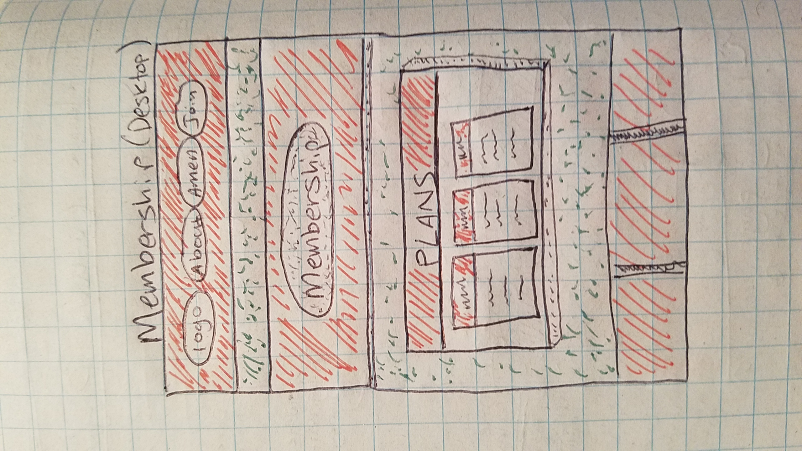

# Mock Freelance Project

### _Created By_ **Joe Friesen**

## Description

This project is a mock freelance project, creating a web site for a new co-working startup.

## Screenshots

#### Sketches:

Landing page (Desktop) | Landing (Tablet)
:-----------------------: | :-----------------------:
 | 
Landing (Mobile) | About Us
 | 
Amenities | How to Join
 | 

#### Wireframes:
Landing page (Desktop) | Landing (Tablet)
:-----------------------: | :-----------------------:
 | 
 | 

#### Prototypes:

 | 
---------------------- | -----------------------
 | 

#### Final Design:

 | 
---------------------- | -----------------------
 | 

## User Stories

## Technologies Employed

* HTML
* Bootstrap CSS
* CSS
* SASS CSS Preprocessing
* JavaScript
* jQuery

## Installation Instructions

* Clone this repository to your machine.
* Open _/freelance-cowork-project/index.html_.

### Legal

Copyright (c) 2018 [Joseph Friesen](mailto:friesen.josephc@gmail.com)
